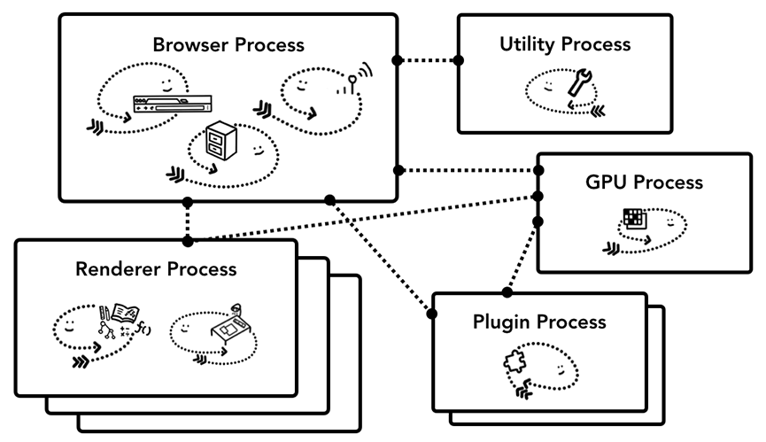
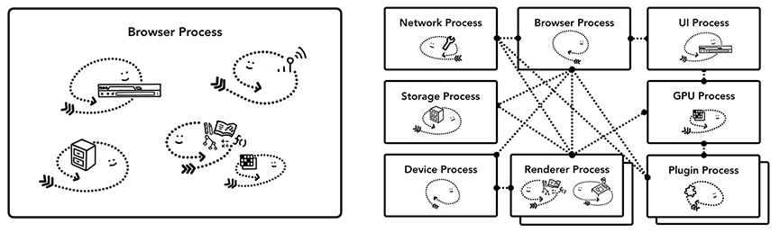
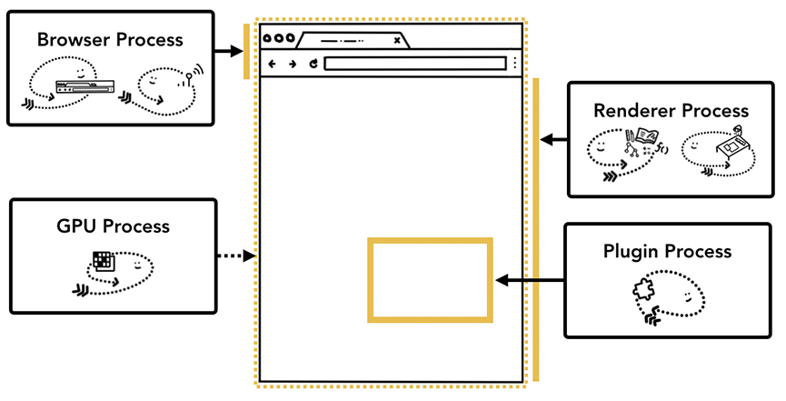
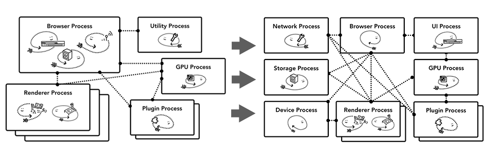
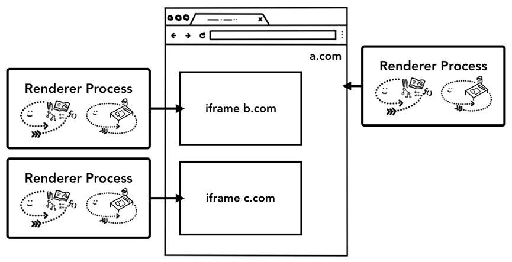

# Introdution

    Привет!
    Это домшнее задание по теме "Web-browsers".
    Здесь будет кратко рассмотрена работа 
    open-source browser Chromium.

# Installing

    # Вы можете установить программу chromium из репозитория
    # вашего дитрибутива
    $ pacman -S chromium    # Arch
    # Или из исходников.
    $ git clone https://chromium.googlesource.com/chromium/src -b main --single-branch --depth 1 chromium-git

# Chromedriver

    [!] Надо пояснить один момент:
    В пакет chromium входит также chromedriver, который является
    фронтендом бразуера chrome/chromium, выполнен по принципу
    клиент-серверной архитектуры.
    Опции:
        --port=PORT
        --log-path=FILE
        --log-level=LEVEL
        --enable-chrome-logs
    [!] chromedriver реализует протокол "W3C WebDriver", является
         backend-ом для Chrome DevTools (Инструментов по разработке)
    [!] пакет "Selenium Chrome Driver" является Java API браузером, 
         подобный пакет имеется и в pip (python).

    [!] В конце будет представлен пример простого кода на python 
         с использованием selenium для взаимодействия с chrome.

    $ chromedriver --help   # показывает все возможные опции
    $ chromedriver --port 9000 --log-path=/tmp/chromedriver.log --log-level=INFO   # Запускает chromedriver на прослушивание и записывает логи в /tmp/chromedriver.log

# Multiprocessing

    Бразуеры, как довольно сложные приложения разделяются на потоки и процессы.
    Это обеспечивает безопасность работы и возможность останавливать/обновлять каждую часть
    независимо друг от друга.
    
    Ниже представлены возможные архитектуры браузеров.

## Возможная архитектура browser-а (1)
 

## Возможная архитектура browser-а (2)
    

    Первая схема была действующей на момент 2017 года.
    *Browser-process - главный процесс, который управляет остальными процессами, но также принимает ввод (для примера: клавиатура/микрофон).
                        Также ответственнен за работу с сетью и доступ к файлам. За верхнюю панель экрана также отвечает именно данный процесс.
    *Renderer-process - процесс рендеринга, до недавнего времени Renderer-process распределялись на каждую вкладку.
                         Теперь chrome старается дать *Renderer-proccess каждому сайту. Отоброжает веб-сайт.
    *Plugin - управляет разными плагинами и расширениями браузера.
    *GPU-process - работает с GPU (не напрямую).

### Место каждого процесса в работе браузера.

# Memory

    Chrome способен менять свою архитектуру в зависимости от целевой сборки, как следствие, обеспечивается экономия памяти.
    Это происходит по причине того, что ОС тратит много ресурсов на *multiprocessing и, как следствие, на устройствах с ограниченными
    ресурсами это приводит к торможениям и лагам.

## Пример перехода Chrome с *монолитной архитектуры на *сервисно ориентированную архитектуру.

# Isolation

    *Сайто-изоляция - является основным параметром безопасности браузера, поскольку предотавращает 
    возможность мошенников получить информацию с другого сайта без согласия.
    *Сайто-изоляция по-существу является способностью браузера создавать отдельный *Renderer-process на
    каждоый сайт, даже, если это происходит в *iframe уже существующего *Renderer-process.
    С версии Chrome 67 *сайто-изоляция стала параметром по умолчанию.
    
    [!] Особенно важно настроить незаметную работу данной системы, чтобы пользователи не могли заметить изоляцию сайтов.

## Пример *сайто-изоляции

